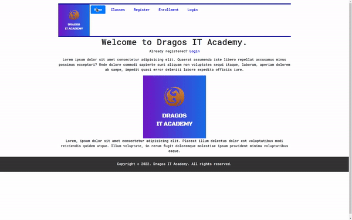

# Flask project - Dragos IT Academy



## **Setup**

```
git clone https://github.com/k1lgor/flask.git
cd flask
python -m venv venv && pip install -r requirements.txt
source venv/bin/activate
flask run
```
## [Open localhost](http://localhost)


- I have used MongoDB Compass for Database
- TODO: Connect DB to MongoDB Atlas